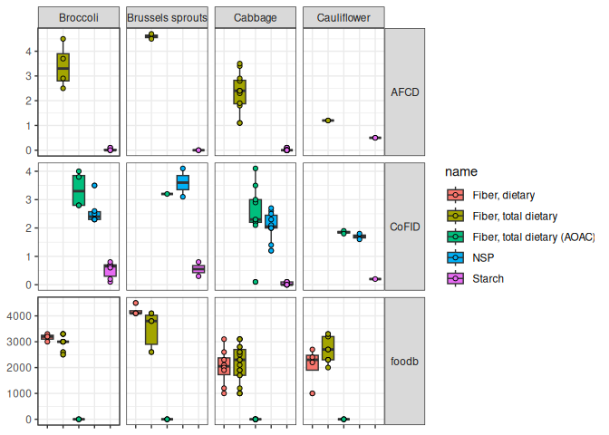

## Source databases

[lsb](https://www.leibniz-lsb.de/en/research/technology-facilities/databases)  
[foodb](https://foodb.ca/)  
[AFCD](https://www.foodstandards.gov.au/science-data/monitoringnutrients/afcd/australian-food-composition-database-download-excel-files#nutrient)

``` r
source("R/prep_afcd.R")
```

    ## ── Attaching core tidyverse packages ──────────────────────── tidyverse 2.0.0 ──
    ## ✔ dplyr     1.1.4     ✔ readr     2.1.5
    ## ✔ forcats   1.0.0     ✔ stringr   1.5.1
    ## ✔ ggplot2   3.5.1     ✔ tibble    3.2.1
    ## ✔ lubridate 1.9.4     ✔ tidyr     1.3.1
    ## ✔ purrr     1.0.4     
    ## ── Conflicts ────────────────────────────────────────── tidyverse_conflicts() ──
    ## ✖ dplyr::filter() masks stats::filter()
    ## ✖ dplyr::lag()    masks stats::lag()
    ## ℹ Use the conflicted package (<http://conflicted.r-lib.org/>) to force all conflicts to become errors

``` r
source("R/prep_foodb.R")
source("R/prep_nutcomp.R")
```

    ## Rows: 182 Columns: 47
    ## ── Column specification ────────────────────────────────────────────────────────
    ## Delimiter: ","
    ## chr  (7): Food Code, Food Name, Description, Group, Previous, Main data refe...
    ## dbl (40): Water (g), Total nitrogen (g), Protein (g), Fat (g), Carbohydrate ...
    ## 
    ## ℹ Use `spec()` to retrieve the full column specification for this data.
    ## ℹ Specify the column types or set `show_col_types = FALSE` to quiet this message.

``` r
library(tidyverse)
```

    ## ── Attaching core tidyverse packages ──────────────────────── tidyverse 2.0.0 ──
    ## ✔ dplyr     1.1.4     ✔ readr     2.1.5
    ## ✔ forcats   1.0.0     ✔ stringr   1.5.1
    ## ✔ ggplot2   3.5.1     ✔ tibble    3.2.1
    ## ✔ lubridate 1.9.4     ✔ tidyr     1.3.1
    ## ✔ purrr     1.0.4     
    ## ── Conflicts ────────────────────────────────────────── tidyverse_conflicts() ──
    ## ✖ dplyr::filter() masks stats::filter()
    ## ✖ dplyr::lag()    masks stats::lag()
    ## ℹ Use the conflicted package (<http://conflicted.r-lib.org/>) to force all conflicts to become errors

``` r
do.call(
    rbind,
    list(
        afcd_df %>% mutate(db = "AFCD"),
        foodb_df %>% mutate(db = "foodb"),
        nutcomp_df %>%
            dplyr::select(colnames(afcd_df)) %>%
            mutate(db = "nutcomp")
    )
) %>%

    ggplot() +
    aes(x = name, y = value, fill = name) +

    geom_boxplot(aes(group = name)) +
    geom_point(shape = 21) +

    xlab(NULL) +
    ylab(NULL) +

    facet_grid(db ~ Food.Cat, scales = "free_y") +
    theme_bw() +
    theme(
        axis.text.x = element_blank(),
        strip.text.y.right = element_text(angle = 0)
    )
```

    ## Warning: Removed 6 rows containing non-finite outside the scale range
    ## (`stat_boxplot()`).

    ## Warning: Removed 6 rows containing missing values or values outside the scale range
    ## (`geom_point()`).

<!-- -->
