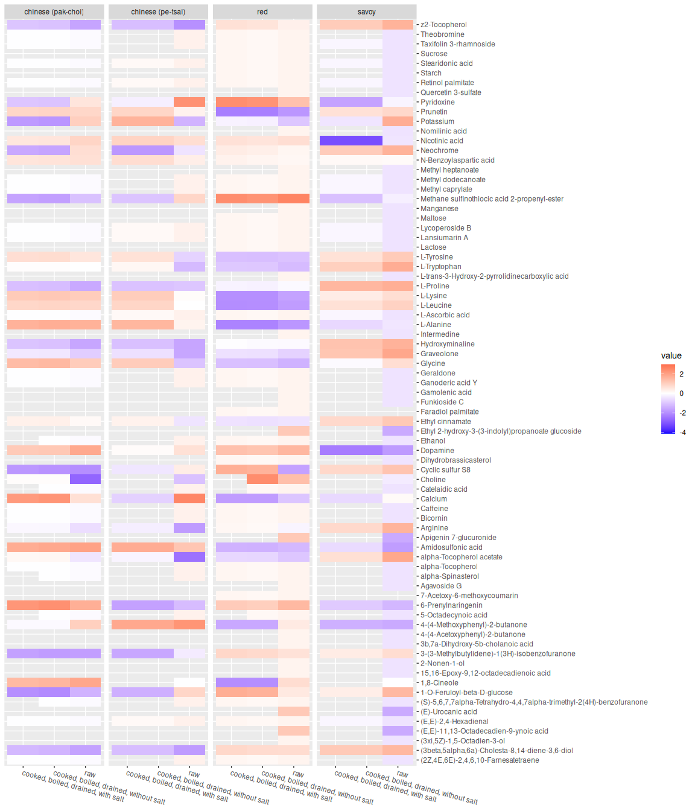
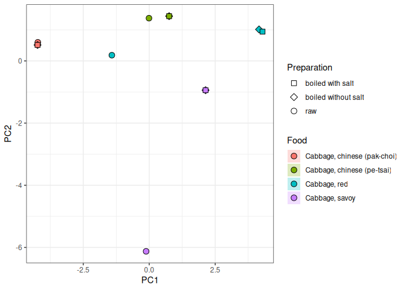

## Source databases

[lsb](https://www.leibniz-lsb.de/en/research/technology-facilities/databases)  
[foodb](https://foodb.ca/)  
[AFCD](https://www.foodstandards.gov.au/science-data/monitoringnutrients/afcd/australian-food-composition-database-download-excel-files#nutrient)
 
[CoFID](https://www.gov.uk/government/publications/composition-of-foods-integrated-dataset-cofid)

``` r
source("R/prep_afcd.R")
source("R/prep_foodb.R")
source("R/prep_cofid.R")
```

    ## Rows: 182 Columns: 47
    ## ── Column specification ────────────────────────────────────────────────────────
    ## Delimiter: ","
    ## chr  (7): Food Code, Food Name, Description, Group, Previous, Main data refe...
    ## dbl (40): Water (g), Total nitrogen (g), Protein (g), Fat (g), Carbohydrate ...
    ## 
    ## ℹ Use `spec()` to retrieve the full column specification for this data.
    ## ℹ Specify the column types or set `show_col_types = FALSE` to quiet this message.

``` r
source("R/cabbage_comparison.R")
```

    ## ── Attaching core tidyverse packages ──────────────────────── tidyverse 2.0.0 ──
    ## ✔ dplyr     1.1.4     ✔ readr     2.1.5
    ## ✔ forcats   1.0.0     ✔ stringr   1.5.1
    ## ✔ ggplot2   3.5.1     ✔ tibble    3.2.1
    ## ✔ lubridate 1.9.4     ✔ tidyr     1.3.1
    ## ✔ purrr     1.0.4     
    ## ── Conflicts ────────────────────────────────────────── tidyverse_conflicts() ──
    ## ✖ dplyr::filter() masks stats::filter()
    ## ✖ dplyr::lag()    masks stats::lag()
    ## ℹ Use the conflicted package (<http://conflicted.r-lib.org/>) to force all conflicts to become errors

``` r
cabbage_df %>%
    filter(!is.na(food_1)) %>%

    ggplot() +

    aes(x = food_2, y = name, fill = value) +
    geom_tile() +

    scale_y_discrete(position = "right") +
    scale_fill_gradient2(high = "red", low = "blue", midpoint = 0) +

    xlab(NULL) + 
    ylab(NULL) + 
    facet_wrap(~food_1, scales = "free_x", ncol = 4) +
    theme(axis.text.x = element_text(hjust = 0, angle = 345))
```

<!-- -->

``` r
source("R/pca_cabbage_comparison.R")
ggplot(pca) +
    aes(
        x = PC1,
        y = PC2,
        fill = Food,
        shape = Preparation
    ) +

    #Create the points and ellipses
    stat_ellipse(geom = "polygon", alpha = 1 / 4) +
    geom_point(size = 3, col = "black") +

    scale_shape_manual(
        values = c(
            "raw" = 21,
            "boiled with salt" = 22,
            "boiled without salt" = 23
        )
    ) +
    guides(fill = guide_legend(override.aes = list(shape = 21))) +

    theme_bw()
```

    ## Too few points to calculate an ellipse
    ## Too few points to calculate an ellipse
    ## Too few points to calculate an ellipse
    ## Too few points to calculate an ellipse
    ## Too few points to calculate an ellipse
    ## Too few points to calculate an ellipse
    ## Too few points to calculate an ellipse
    ## Too few points to calculate an ellipse
    ## Too few points to calculate an ellipse
    ## Too few points to calculate an ellipse
    ## Too few points to calculate an ellipse
    ## Too few points to calculate an ellipse

<!-- -->
