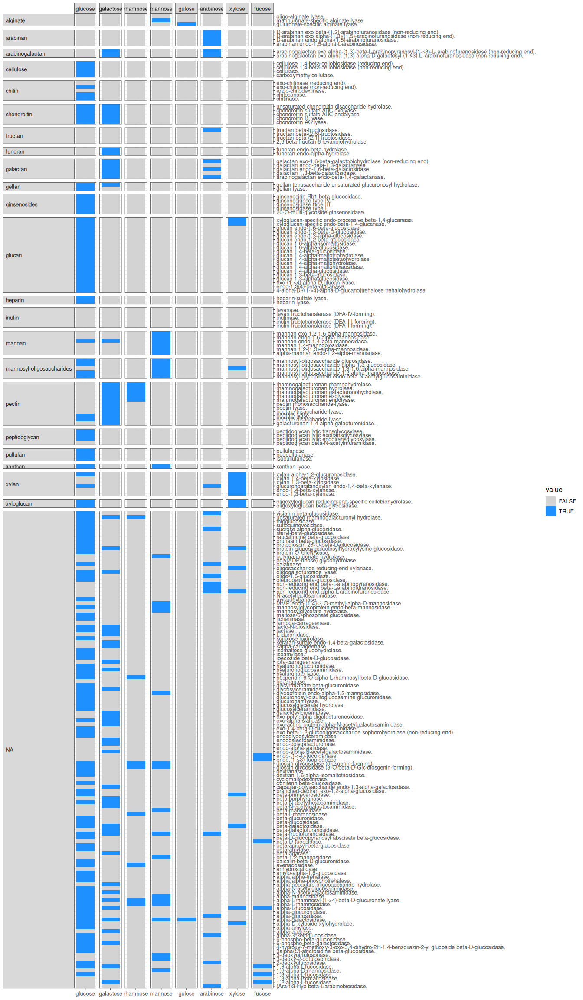

## Source databases

[lsb](https://www.leibniz-lsb.de/en/research/technology-facilities/databases)  
[foodb](https://foodb.ca/)  
[AFCD](https://www.foodstandards.gov.au/science-data/monitoringnutrients/afcd/australian-food-composition-database-download-excel-files#nutrient)
 
[CoFID](https://www.gov.uk/government/publications/composition-of-foods-integrated-dataset-cofid)

``` r
source("R/ec_to_fibre.R")
```

    ## ── Attaching core tidyverse packages ──────────────────────── tidyverse 2.0.0 ──
    ## ✔ dplyr     1.1.4     ✔ readr     2.1.5
    ## ✔ forcats   1.0.0     ✔ stringr   1.5.1
    ## ✔ ggplot2   3.5.1     ✔ tibble    3.2.1
    ## ✔ lubridate 1.9.4     ✔ tidyr     1.3.1
    ## ✔ purrr     1.0.4     
    ## ── Conflicts ────────────────────────────────────────── tidyverse_conflicts() ──
    ## ✖ dplyr::filter() masks stats::filter()
    ## ✖ dplyr::lag()    masks stats::lag()
    ## ℹ Use the conflicted package (<http://conflicted.r-lib.org/>) to force all conflicts to become errors

``` r
plot_ecs
```

<!-- -->
